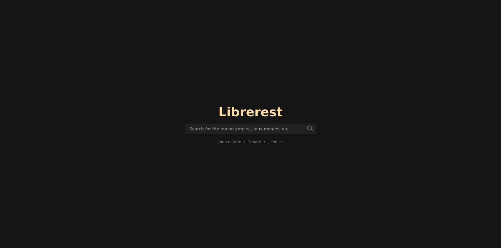
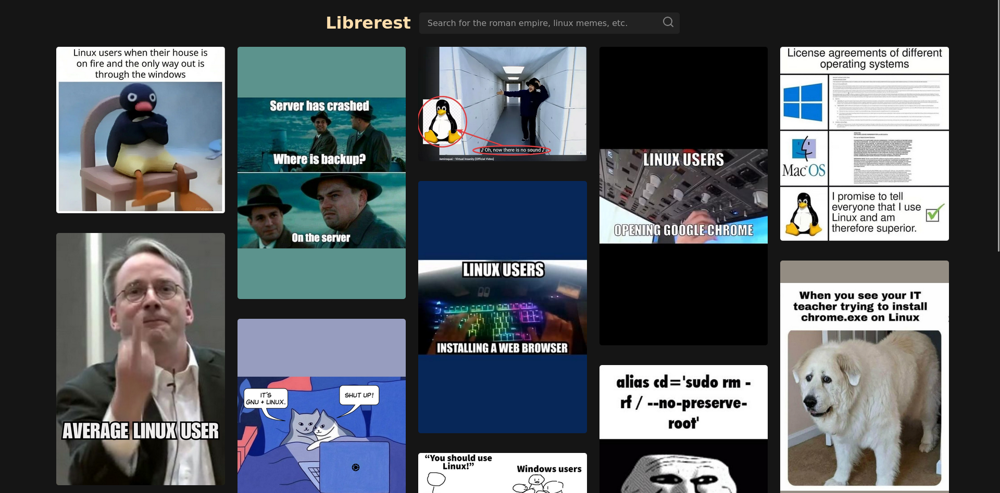

# Librerest
A Privacy-Focused Pinterest Frontend.
- No tracking
- No exposing your IP address; connections are proxied
- No JavaScript
- No cookies
- No hassle

## Screenshots

## Instances
Centralization is bad, clone this site!
| URL | Location | Cloudflare |
|-|-|-|
| https://librerest.example.com | 🇺🇸 US ||

## Speed
| Performance Metric | Librerest | Pinterest |
|-|-|-|
| Performance | 100% | 30% |
| Speed Index | 0.2 s | 4.4 s |

Speed test results: [Librerest](https://pagespeed.web.dev/analysis?url=https://librerest.bunk.lol/), [Pinterest](https://pagespeed.web.dev/analysis?url=https://www.pinterest.com/)

## How to deploy
1. Install docker
2. Configure docker-compose.yml
3. Run `docker compose up -d` to build and run the container as a daemon.
